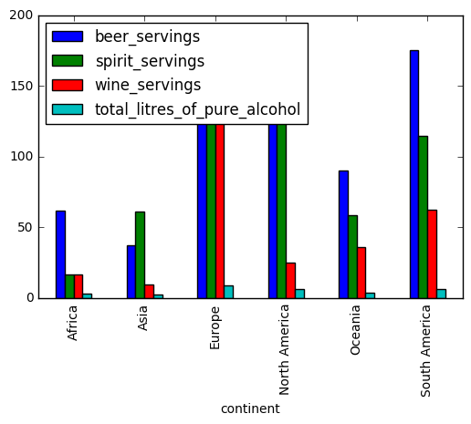

#  nm2762 review of lx565


```python

```


```python
import pandas as pd
import matplotlib.pylab as plt

%matplotlib inline
```


```python
#read data 
data = pd.read_csv("http://bit.ly/drinksbycountry")
```


```python
data.head() 
data.groupby('continent').mean()
data.groupby('continent').mean().plot(kind = "bar")
newdata = data.groupby('continent').mean()
newdata
```


<div>
<table border="1" class="dataframe">
  <thead>
    <tr style="text-align: right;">
      <th></th>
      <th>beer_servings</th>
      <th>spirit_servings</th>
      <th>wine_servings</th>
      <th>total_litres_of_pure_alcohol</th>
    </tr>
    <tr>
      <th>continent</th>
      <th></th>
      <th></th>
      <th></th>
      <th></th>
    </tr>
  </thead>
  <tbody>
    <tr>
      <th>Africa</th>
      <td>61.471698</td>
      <td>16.339623</td>
      <td>16.264151</td>
      <td>3.007547</td>
    </tr>
    <tr>
      <th>Asia</th>
      <td>37.045455</td>
      <td>60.840909</td>
      <td>9.068182</td>
      <td>2.170455</td>
    </tr>
    <tr>
      <th>Europe</th>
      <td>193.777778</td>
      <td>132.555556</td>
      <td>142.222222</td>
      <td>8.617778</td>
    </tr>
    <tr>
      <th>North America</th>
      <td>145.434783</td>
      <td>165.739130</td>
      <td>24.521739</td>
      <td>5.995652</td>
    </tr>
    <tr>
      <th>Oceania</th>
      <td>89.687500</td>
      <td>58.437500</td>
      <td>35.625000</td>
      <td>3.381250</td>
    </tr>
    <tr>
      <th>South America</th>
      <td>175.083333</td>
      <td>114.750000</td>
      <td>62.416667</td>
      <td>6.308333</td>
    </tr>
  </tbody>
</table>
</div>





# I believe that the plot only need one improvement which is to move the legend out of the graph.


```python

```
